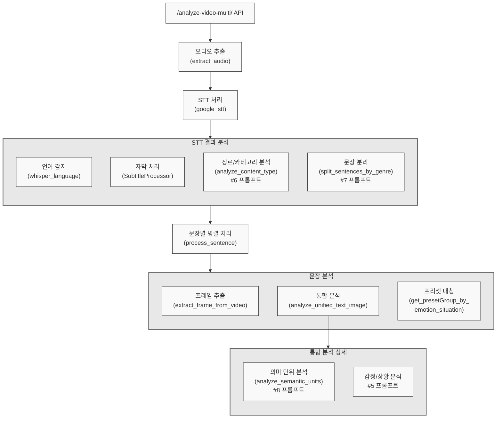

# analyze_video_multi API 문서

## 개요

`analyze_video_multi` API 엔드포인트는 비디오 파일을 처리하여 오디오를 추출하고, 음성을 텍스트로 변환하며, 콘텐츠를 분석하여 각 문장에 대한 감정, 상황, 의미 단위를 포함한 상세 분석을 생성합니다.

## API 엔드포인트

```typescript
POST /analyze-video-multi/
매개변수:
- video: UploadFile (비디오 파일)
- language_code: string (기본값: "ko-KR")
```

## 처리 흐름도



## 프롬프트 사용 및 섹션 구성

API는 여러 프롬프트 ID를 사용하며, 각각 특정 섹션으로 구성됩니다:

### 1. 콘텐츠 유형 분석 (ID: "6")

- 사용 위치: `analyze_content_type`
- 섹션 구성: # 구분 없음
- 목적: 텍스트의 콘텐츠 유형과 장르 분석
- 호출 시점: STT 결과 처리 후 장르 및 카테고리 분석 시

### 2. 문장 분리 (ID: "7")

- 사용 위치: `split_sentences_by_genre`
- 섹션 구성: # 구분 사용
  - 섹션 1: 초기 문장 분리
  - 섹션 2: 정제 처리
- 목적: 장르에 따른 적절한 문장 분리
- 호출 시점: 장르 분석 완료 후 문장 분리 시

### 3. 감정/상황 분석 (ID: "5")

- 사용 위치: `analyze_unified_text_image` 내부
- 섹션 구성: # 구분 없음
- 목적: 텍스트와 이미지 기반 감정 및 상황 분석
- 시스템 프롬프트: 단일 프롬프트로 감정과 상황을 동시에 분석
- 호출 시점: 문장별 병렬 처리 중 통합 분석 시

### 4. 의미 단위 분석 (ID: "8")

- 사용 위치: `analyze_unified_text_image` 내부의 `analyze_semantic_units`
- 섹션 구성: # 구분 없음
- 목적: 텍스트의 의미 단위 분석
- 호출 시점: 문장별 병렬 처리 중 의미 단위 추출 시

## 응답 형식

```typescript
interface VideoAnalysisResponse {
  success: boolean;
  subtitles: Array<{
    text: string;
    start: number;
    end: number;
    mid: number;
    emotion: string;
    situation: string;
    presetId?: string;
  }>;
  category?: string;
  error?: string;
}
```

## 상세 처리 단계

1. **오디오 추출**

   - 함수: `extract_audio`
   - 입력: video (UploadFile), output_format ("wav")
   - 출력: 추출된 오디오 파일 경로

2. **음성 인식 및 기본 분석**

   - 함수: `google_stt`
   - 처리 내용:
     - 음성을 텍스트로 변환
     - 문장 분리
     - 카테고리 식별
     - 언어 코드 처리

3. **병렬 분석 처리**
   a. **언어 감지**

   - 함수: `whisper_language`
   - 목적: 음성의 언어 자동 감지

   b. **STT 결과 처리**

   - 클래스: `SubtitleProcessor`
   - 목적: 자막 형식 처리 및 최적화

   c. **장르 및 카테고리 분석**

   - 함수: `analyze_content_type`
   - 프롬프트: ID "6"
   - 목적: 콘텐츠 유형 분류

   d. **장르 기반 문장 분리**

   - 함수: `split_sentences_by_genre`
   - 프롬프트: ID "7"
   - 목적: 장르에 맞는 문장 분리

4. **문장별 상세 분석**

   - 함수: `process_sentence`
   - 각 문장에 대해 병렬 처리:
     a. **프레임 추출**

     - 함수: `extract_frame_from_video`
     - 목적: 해당 문장 시점의 비디오 프레임 추출

     b. **통합 분석**

     - 함수: `analyze_unified_text_image`
     - 처리 내용:
       - 의미 단위 분석: `analyze_semantic_units` (프롬프트 ID "8")
       - 감정/상황 분석: 직접 처리 (프롬프트 ID "5")

     c. **프리셋 그룹 매칭**

     - 함수: `get_presetGroup_by_emotion_situation`
     - 목적: 분석된 감정, 상황, 카테고리에 맞는 프리셋 매칭

## 오류 처리

- 각 단계별 포괄적인 오류 처리 구현
- VideoAnalysisResponse를 통한 오류 전파
- 전체 프로세스에 디버그 로깅 구현

## 성능 고려사항

- 향상된 성능을 위한 문장 병렬 처리
- 오래된 프레임 이미지 자동 정리
- 비디오 처리를 위한 효율적인 메모리 관리
- STT 및 분석 작업의 비동기 처리
